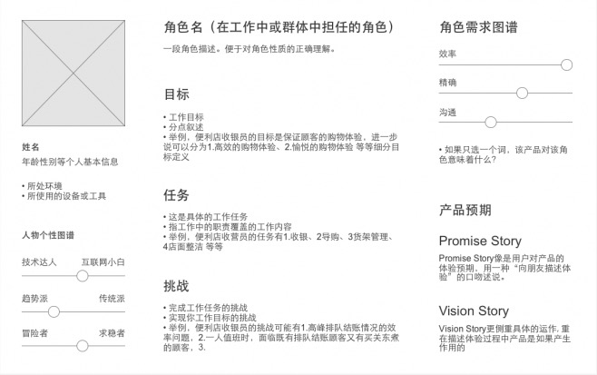
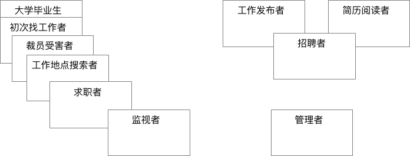
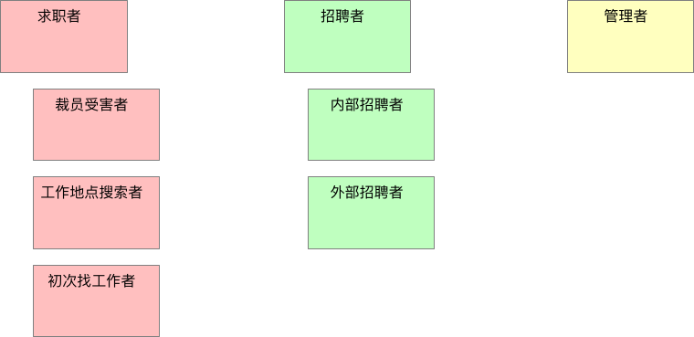
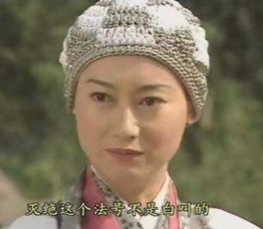

# 3. 用户角色建模

在很多项目中，需求分析人员只从一个角度来写用户故事， 这样往往会忽略一些需求（故事），因为有些故事针对的不是系统的一般用户。

以**用户为中心的设计**(`user-centered design, Constantine and Lockwood, 1999`)和**交互设计**(`interaction design, Cooper, 1999`)的规则使我们懂得，在编写故事前识别用户角色和虚构人物(`persona`)有很多好处。

我们接下来将要讨论如何利用**用户角色**、**角色建模**、**角色映射**和**虚构人物**这些初始步骤来编写更好的故事，开发更好的软件。

## 3.1. 用户角色

### 用户是谁？

假设，我们依然从可以招聘网站谈起，这类网站会有许多中**不同类型的用户**。

当我们谈起“用户故事”时，我们说的**用户是谁**？

>我们是在谈论`张无忌`吗？他现在“骑驴找马”总在留意更好的工作。是`殷离`吗？她是大学应届毕业生，正在找第一份工作。还是`杨逍`？他将接受任何工作，只要那份工作可以让他搬到昆仑山光明顶。或是`韦一笑`？他不讨厌现在的工作，但他觉得是时候换一份工作了。也许我们讨论的是`丁敏君`，她六个月前被裁员了，正在找一份工作地点在峨眉山的工作。

或许我们应该考虑一下需要发布工作的公司内的用户？

> 用户可能是`灭绝师太`，她来自于峨眉派的人力资源部，由她来发布工作信息。或者是`孤鸿子`，他也在峨眉派的人力资源部工作，但是他的职责是审核简历。或者是`黛绮丝`，她是独立的猎头，同时关注好工作和优秀人才。

显然，我们不能从单一的角度来编写故事，要让这些故事反应所有这些用户的经历、背景和目标是不现实的。

- `张无忌`，会计师，可能每个月只上一次我们的网站，以保留他选择的余地
- `杨逍`，服务员，可能想创建一个过滤器。此过滤器可以第一时间通知他光明顶上有新的工作发布。除非我们提供这个功能，要不然他实现不了这个想法。
- `丁敏君`，可能每天花几个小时来寻找工作，并不断扩大她的搜索范围。
- `灭绝师太`和`孤鸿子`他们的公司比较大，有很多职位需要他们填补，那么他们可能要在我们网站上消耗4个小时，甚至更多。

### 什么是用户角色

虽然用户有着不同的背景，有不同的目标，但我们仍然可以把这些单独的客户进行分组，把每一类作为一种“用户角色(`User Role`)”。

**用户角色是一组属性的集合，这些属性刻画了一群人的特征以及这群人与系统可能的交互。**

我么可以看看之前例子中的用户，将他们进行角色分组：

| 类型 | 姓名 |
|--|--|
| 求职者 | 韦一笑 |
| 初次求职者 | 殷离 |
| 裁员受害者 | 丁敏君 |
| 工作地点搜索者 | 杨逍 |
| 监视者 | 张无忌 |
| 工作发布者 | 灭绝师太、黛绮丝 |
| 简历阅读者 | 孤鸿子、黛绮丝 |

> 上面这个表并不是对招聘网站的用户进行角色分组的唯一方式。例如，可以包含诸如兼职者、全职者和合同工等角色。

显然，针对不同用户角色的故事之间会有些重复。求职者、初次求职者、裁员受害者、工作地点搜索者和关注者都会使用网站的工作搜索特性，但是他们使用搜索功能的方式和频率可能会不同，针对简历阅读者和工作发布者的故事也可能重复，因为这些角色的目标都是找到好的候选人。

## 3.2. 角色建模的步骤

我们将使用下面的步骤来**识别、选择有用的用户角色集合**。

### 1. 通过头脑风暴，列出初始的用户角色集合

为了识别用户角色，客户和开发人员（多多益善）聚集在一个房间里，房间里要有一张大桌子或一堵墙，这样他们就有地方粘贴或固定卡片。

理想情况是在项目启动时，把团队所有成员聚集在一起进行用户角色建模，但这并不是必须的，只要有一定数量的开发人员和客户一同参与，会议往往能取得成功。

每个参与者从桌子中间堆放的记录卡中取出一叠（即打算用电子文档来记录用户角色，也应该从手写记录开始）。每个人先在卡片上写下角色名称，然后把他们放在桌子上，或者贴在墙上。

放上新的角色卡片后，作者只说出新角色的名字，不做其它任何事情。这个会议只做头脑风暴，无需对卡片进行讨论，也不需要对角色进行评估。

每个人要做的至少尽量在卡片上写出自己想到的角色。不需要让大家轮流给出新的角色。想到一个新角色就把它写到卡片上。

在头脑风暴过程中，房间里会充满书写卡片的声音，偶尔夹杂着放置新卡片或朗读角色名称的声音。这样继续下去直到大家没有新的进展，并且很难再相出新的角色。

尽管此时有可能还没有找到所有的角色，但其实已经很接近了。这样的头脑风暴很少会超过15分钟。

> 一个用户角色是一个用户

对项目的角色进行头脑风暴时，要坚持“**已确认的角色代表的是单一用户**”的原则。

### 2. 整理最初的角色集合

接下来需要**整理**这些角色了。

在桌子上或墙上移动卡片的位置，以表明角色之间的关系。对于有重叠的角色，把它们对应的卡片也重叠到一起。如果角色只有一点点重叠，那么卡片也只重叠一点点。如果角色完全重叠，那么卡片也完全重叠。

> 上面的图中显示了这样的角色之间的关系

- “大学毕业生”和“初次找工作者”，他们的角色有显著的重叠
- 其他将使用工作搜索功能的人而言，它们的角色卡片也有较小但类似的重叠
- “监视者”的角色卡片与其他卡片仅仅稍有重叠，因为这个角色代表的是那些对现有工作相对满意的人，但他们同时有喜欢留意好的机会
- 右侧角色是“工作发布者”、“招聘人员”和“简历阅读者”的角色卡片，由于“招聘者”既需要发布招聘广告，也会阅读简历
- “管理者”角色也在其中展示，这个代表这个招聘网站的内部用户，他们要支持这个网站的运营

#### 系统角色

尽量坚持一个原则：**用户角色定义的是人，而不是其他外部系统**。如果觉得有必要，可以偶尔引入一个非人物的**系统角色**(non-human user role)。然而，确认用户角色的目的是确保我们很周到的为用户考虑，我们要绝对的、积极地让用户对新系统感到免疫，我们不需要为每一个可以想到的系统用户简历角色，但需要那些能影响项目或成败的角色。

由于其他外部系统很少回事我们系统的购买者，它们很少能决定我们系统的成败。

不过，事情总有例外，如果觉得加入一个非人物的系统就是有助于思考系统，将它加入也未尝不可。

### 3. 整理角色

在角色分组完成后，需要试着**整合和合并**角色了。可以从完全重叠的卡片入手。

首先，这些卡片的作者描述一下他们的角色名究竟代表什么，在简短的小组讨论之后，再判断这些角色是否等同。如果等同，那么这些角色要么合并成单一的角色（也行可以根据这两个初始的角色名去一个新的名字），要么丢弃掉其中一张角色卡。

从[整理最初的角色集合](#2-整理最初的角色集合)的图中可以看到“大学毕业生”和“初次找工作者”这两个角色有很大重叠，基本这两个角色的故事都是相同的，所以决定丢弃“大学毕业生”角色卡。

虽然“初次找工作者”、“裁员受害者”、“工作地点搜索者”和“求职者”有显著的重叠，但是还是决定留下它们，是因为这些角色**每个都代表了系统需要满足的重点方面**。这些角色也使得网站的目标也有微妙的不同，这很重要。

图的右侧，小组认为**区分“简历发布者”和“简历阅读者”没有什么价值**。所以决定，**“招聘者”这个角色会充分覆盖另外两个角色**，所以这两个角色的卡片被抛弃。然后小组觉得内部招聘者（为某个公司工作）和外部招聘者（为任何公司寻找合适的人选）有所不同。他们为内部招聘者和外部招聘者都写了新的卡片，并将这两个角色当成招聘者角色的特殊版本。

除了需要合并重叠的角色外，小组还应该**丢弃那些对系统成功不太重要的角色卡**。例如，“监视者”角色卡代表了哪些只关注工作市场的人，他们可能好几年都不换工作。即使不关注这样的角色，网站也能做的很出色。

他们认定**最好能关注那些对公司成功更重要的角色**，比如“求职者”和“招聘者”角色。

**最终整理的角色卡组合**

### 4. 提炼角色

一旦我们整合好角色，并对角色之间的关系有了一个基本的了解，就可以能通过**给每个角色定义一些特征来建立角色的模型**。

**角色特征是关于同属于这一类的用户事实或者有用信息。**

这里有一些适用于任何角色建模的角色特征：

- 用户使用软件的频率
- 用户在相应领域的知识水平
- 用户使用计算机和软件的总体水平
- 用户对当前正在开发的软件的熟悉程度
- 用户使用该软件的总体目标。有些用户注重使用的便捷性，有些关注丰富的用户体验，等等。

除了这些标准的特征，应该考虑对于正在开发的软件，是否有意向对描述其用户有帮助的特征。例如，对于我们正在设计的招聘网站，可以考虑某个用户是在寻找全职工作还是兼职工作。

在确定角色的有趣特征时，可以在角色卡片上写下注释。完成后，可以把角色卡挂在团队的公共区域，用来提示团队成员。

|用户角色：内部招聘者|
|--|
|1. 不是很擅长使用电脑，但使用网络相当娴熟。|
|2. 不经常使用该软件，但每次使用强度大。|
|3. 他将阅读其他公司招聘广告，以此选择最好的措辞来完成他们的招聘广告。|
|4. 使用简单很重要，但更重要的是，他学会的东西必须在几个月后能够很容易的回想起来。|

## 3.3. “虚构人物”和“极端人物”

如果之前描述[用户角色建模](#32-角色建模的步骤)都做完了，已经绝对比99%的其他软件团队多费了心思。大部分的团队确实可以到此为止了。

不过，还有两个额外的技术值得探讨，因为它们**有助于我们考虑某些系统的用户**。当然，我们会在它们**适用于为项目带来明显的好处是才会引入**。

### 虚构人物

识别用户角色是一个伟大的飞跃，但对于有些更为重要的用户角色，再进一步为角色创建一个虚构人物是很值得的。

> 虚构人物是假象的用户角色代表。

创建虚构人物不只是在用户角色上加上一个名字。对于虚构人物的描述应当是十分充分的，让团队的每个人都觉得他们知道这个任务。

例如，之前我们提到“灭绝师太”，她要为她的公司发布工作信息。那她的描述可能是这样：

> 灭绝师太在峨眉派的人事部负责招聘工作，该公司是一个高端网络组件制造商。她已经在该公司工作6年。
> 灭绝师太有弹性的时间安排，每周周五她在家工作。
> 灭绝师太对电脑相当在行，她觉得对于自己所使用的软件产品，她几乎都是超级用户。
> 由于灭绝师太年轻时感情上受过伤害，并且一直忙于工作，40多了还没有结婚，也没有男朋友。她对男性的简历会吹毛求疵，要求很高。
> 由于峨眉派几乎一直在扩张，灭绝师太总是在物色优秀的工程师。
> 由于灭绝师太自以为是电脑行家，她对使用的软件和系统要求都很挑剔，容忍度极低。

假如选择为项目创建虚构人物，要注意，应当**事先做好充分的市场和目标用户群调查**，要确保虚构人物能够**真正代表产品的目标用户**。

我们加上了对灭绝师太的描述，如果有照片就更加生动了，应该找一幅灭绝师太的照片，将它也放入到虚构人物的定义中。

从用户角色或虚构人物的角度描述会使故事变得更加生动。识别出用户角色，并且可能有一两个虚构人物后，就可以开始从角色和虚构人物的视角来说话，而不是宽泛的“用户”。

你可以写一个“用户地点搜索者可以限定他搜索到的工作都在指定的地理区域内”的故事，而不是“用户可以限定他搜索到的工作都在指定的地理区域内”的故事。以这种方式编写的用户故事可以提醒团队想起“杨逍”，他在寻找光明顶的工作。

使用用户角色和虚构故事的名字来编写故事，并不意味着其他角色就不能执行那些故事，而是说明在讨论或实现故事时，用特定的用户角色或虚构人物来思考问题，总是有一些好处的。

### 极端人物

`Djajadiningrat`和其他合著者（2000）提出了第二种可以考虑的技术：**考虑新系统的设计是，使用极端人物。**

他们用设计`PDA`（掌上电脑）作为例子。他们建议不要只为一个典型的穿着考究、驾驶宝马的管理顾问做设计，系统设计师应该考虑那些有鲜明个性的用户。具体来说，作者建议为毒贩、教皇和穿梭多个男友之间的女子设计`PDA`。

考虑极端人物很可能会让你编写出原表可能遗漏的故事。例如，很容易想到毒贩和有多个男友的女子都想要维护多份单独的时间表，以防被警察或男友看见。教皇可能没有那么多保密需求，但可能想要更大字号的字体。

使用极端人物可以导致新的故事产生，但是很难事先确定是否应该讲哲学故事包含在产品中。当然，在极端人物投入大量时间也是不值得的，但是你可以尝试一下这两个方法。至少，你可以花几分钟去考虑一下教皇如何使用你的软件，这可能会带来一到两个灵感。

## 3.4. 如果有现场用户该如何？

即使有真实的用户在办公室现场，咱们使用的用户角色建模仍然是有帮助的。与实际用户一起工作会大大提高交付成果所需要的软件的可能性。

然而，即使与实际用户在一起，也无法保证有正确的用户或用户组合。

为了降低无法满足重要客户的可能性，即使有内部用户在的二十号，你们还是应该对项目做一些简单的角色建模。

## 3.5. 职责

### 客户团队职责

- 负责寻找用户（多多益善），并识别恰当的用户角色
- 负责参与与识别用户角色和虚构人物的过程
- 负责确保软件没有关注不恰当的用户
- 在编写故事时，负责确保每个故事都能和至少一个用户角色或虚构人物联系起来
- 开发软件时，负责考虑不同用户角色对于软件如何运行的不同偏好
- 确保在识别和描述用户角色时，它们只是这个过程中的工具，不应超越作为工具之外的用途

### 开发人员职责

- 负责参与确认用户故事和虚构人物的过程
- 负责理解美国用户角色或虚构人物，以及他们之间的异同
- 开发软件时，负责考虑通的用户角色对于软件运行的不同偏好
- 负责确保在识别和描述用户角色时，它们只是这个过程中的工具，不应超越作为工具之外的任何用途

## 3.6. 小结

- 大部分的项目小组只考虑单一的用户类型。这会导致软件忽略原本需要的一些用户类型
- 为了避免从单一用户的角度编写的所有故事，要识别到软件交互的不同用户角色
- 通过对每个用户角色定义相关特征，可以更清楚地看到不同角色间的不同点
- 对于有些用户角色而言，用代表人物来描述会很有帮助。虚构人物是假想出来的用户角色代表。他们有名字，有照片，还有足够的相关细节，因为对项目成员来说，很真实
- 对于有些应用程序，极端人物可能有助于搜集原本被遗漏的故事

## 扩展阅读

- [User-Centered Design](http://www.e-learning.co.il/home/pdf/4.pdf)
- [Notes on User Centered Design Process (UCD)](https://www.w3.org/WAI/redesign/ucd)
