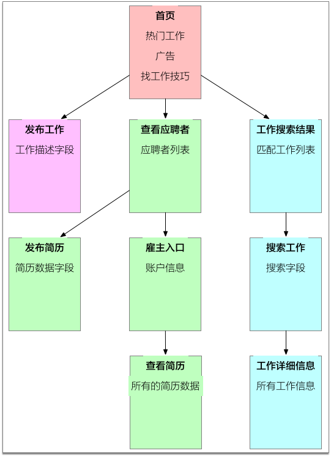

# 故事编写工作坊

故事编写工作坊是开发人员、用户、产品和其他对编写故事有帮助的人共同参加的会议。

在工作坊期间，参与人员编写尽可能多的故事，此时不对故事排优先级。

正确举办故事编写工作坊可以非常快速的编写大量故事。**良好的故事编写工作坊结合了头脑风暴的最佳要素和简单原型法**。可以把一个简单原型画在纸上，笔记本上，白板上，并画出软件内部高层之间的交互。在工作坊中，随着参与者对用户在使用软件过程中可能要做的事情进行头脑风暴，不断构建原型。这并不是像传统原型法或联合应用设计中，要确定实际界面和字段，只是为了**从概念上确定工作流**。

比如，下面就是通过故事编写工作坊整理的招聘网站的简单原型。

其中每个方框代表着网站的一个新组件。方框中带有加粗的文字是组件的标题。标题下面是组件要做的和包含的列表。方框间的箭头标示组件间的链接。对于一个网站，组件可能是一个新的页面或当前页面的一块区域。所以，每一个链接意味着弹出一个新页面或者在同一个页面上显示信息。

> 比如，搜索工作可能是一个页面或者首页上的一块区域。

开始画原型前，首先要决定从哪种用户角色开始。需要用每个角色来重复这个过程，不论什么顺序。然后，画一个空的方框，告诉参与者这是软件的主界面，询问他们当前这个用户角色能在这个界面做什么。即使你现在还不知道主界面是什么，有什么用，这也没有关系。参与者会想出角色会做什么。对角色做的每一件事情，画一条先只想一个新的方框，然后写一个故事。

比如上面的图，我们可以得出以下故事：

- 求职者可以发布他的简历
- 雇主可以发布工作
- 求职者可以搜索工作
- 求职者可以看到搜索条件的工作
- 求职者可以看到指定工作的详细信息

这些故事都不需要界面是该如何设计。但是，走一遍流程可以帮助大家想出尽可能多的故事。

 我发现深度优先的方法最有效：

 > 对于第一个组件，写下主要的细节，接着是与第一个组件相连的组件B，一样写下其主要的细节。然后是与B相连的组件，而不是回到第一个组件A，描述其他与A相连的组件。

 广度优先的办法非常不容易理解，因为很难记住自己刚才在哪条功能线上。