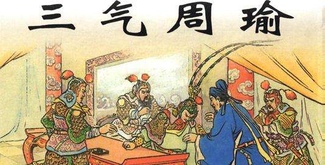
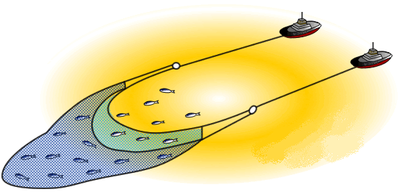

# 4. 收集故事

你是怎么收集故事的？

接下来咱们聊聊**如何和用户一起工作**，如何通过**与他们沟通来发现故事**。

同时介绍各种方法的优点，怎样**提出恰当的问题**，从而**获得用户真正的需求*。

## 4.1. 用“拖网”来收集需求

一些需求相关的书中用到了像“引出”(`Kovitz 1999`; `Lauesen 2002`; `Wiegers 1999`)和“捕捉”(`Jacobson`, `Booch`和`Rumbaugh 1999`)这样的词来描述识别与确认需求的实践。

不过这样的术语给我们一种**错觉**：“需求本来已经存在了，我们只要让客户给我们解释需求，然后把它们锁到一个笼子里就可以了。”很多需求并不容易想到。同样，**用户并不知道所有需求**，所以不能单纯依靠引出(`elicitaion`)。

我们可以用另外一个词--**拖网**(`trawling`)这个词来描述收集需求的过程。怎么理解呢？**要像“拖网渔船捕捞鱼”那样收集需求**。

为什么要用这样的比喻呢？理由如下：

- 首先，**不同大小的网用来捕获不同大小的需求**。第一遍，我们可以用大网眼的渔网捞一遍需求池，以此得到所有的大需求。通过大需求，形成对产品的整体感觉。接下来，用网眼小一些的渔网得到中等大小的需求，展示还不用顾及到那些小需求。在这个比喻中，**大小可以是对此产品的商业价值高低或必要性程度**等。

-  其次，拖网表达了另一个含义:**需求会像🐟一样，会生长，也可能会死亡**。今天渔网可能会漏掉一个需求，因为这个需求对于系统来说不重要。但是，根据每轮迭代的反馈，系统会朝着事先不可预知的方向发展，有些需求会变得越来越重要。同样，有些曾经被认为重要的需求，重要性可能会降低，有时甚至降低到我们认为这些需求已经无效了。

- 第三，正如在**某些区域拖网捕鱼不可能捕到所有的🐟，我们也不可能捕捉到所有的需求**。另外，在拖网捕捞需求的时候，也可能捞到一些废弃的货物或漂浮的残骸，他们使需求膨胀。

- 最后，这个拖网捕捞需求的比喻还说明了一个重要的现实：**技能也是发现需求的一个要素**。一个熟练的需求分析人员（`requirements trawler`）知道要到哪里去找需求，而不熟练的需求分析人员只会用低效的方法或在错误的地方浪费时间。

那我们接下来看看有哪些更有效“捞”到用户故事的方法。

## 4.2. 够用就行，不是吗？

**辨别传统规范过程和敏捷过程最简单的方法之一，是看它们收集需求的方式。**

传统规范过程的特征是它过分强调在项目早期正确的获取并写出所有的需求。与此不同的是，敏捷项目则承认没有一种理想的方法可以在一个单一阶段获取到所有的用户故事。

敏捷过程也承认用户故事有一个**时间维度**： **随着时间的推移以及先前迭代中加入产品的故事，一个故事的相关性(`relevance`)会有变化**。

然而，即使我们承认无法为一个项目编写出所有的故事，我们还是应该在早期尝试编写我们可以编写的故事，即使许多故事还只能停留在十分笼统的阶段。

使用故事的好处之一就是**可以用不同的详尽程度来编写**。我们可以写下“用户可以搜索故事”这样的故事，无论是作为一个占位符，亦或此时我们只是了解到这个程度，这个故事都是恰当的(`placeholder`)。我们可以在**今后将它演进为更小的、更有用的多个故事**。

因此，对应用程序的大部分功能编写故事是非常容易的，其工作量少于用其他方法收集故事。

这并不是鼓励大家在开始一个新项目时花3个月时间来编写用户故事。相反，它要求大家**展望未来的一个发布（大概3-6个月）的时间，故事发布的时间越往后，我们越不需要编写的那么详细**。

> 例如，如果客户或用户说过他们“很可能在此次发布中想要报表功能”，那么简单的在一张卡片上写下“用户可以运行报表”。但是可以就此打住：先不用决定他们是否需要配置自己的报表，报表是否以HTML格式输出，或者是否可以保存报表。

在**项目启动之前，对应用程序的大小有一个大致的了解是很重要的**。通常在对项目拨款以及批准启动它之前，**有必要粗略的了解**一下项目的**成本**和它能够带来的**效益**。为了获知这些问题的答案，需要对项目包含的故事进行初步的深谋远虑。

## 4.3. 方法

因为**故事会随着项目的进展而演进**，所以我们需要一些**可以反复使用的方法来收集故事**。我们使用的技巧**必须是足够轻量的，并且不咄咄逼人，可以持续的、或多或少的应用于故事收集**。

接下来我们会聊一些是创建故事的方法。这些方法有很多是传统业务分析师所使用的。对于配备有业务分析师的项目，应该充分利用他们以“**拖网捕鱼**”的方式来收集故事。

### 4.3.1. 用户访谈

**用户访谈是许多团队用来获取故事的默认方法**，很可能这也是你想使用的方法。

访谈成功的关键之一是**选择正确的受访者**。如同我们接下来要聊的“[与用户代理一起工作](../ch5/)”那样，有许多用户代理可以做访谈。但是显然，**只要有可能，就应该访谈真实用户。还应该访问担任不同角色的用户**。

有一次，一位用户走进我们办公室对我说：“你们的确开发了我所需要的应用，但它并不是我真正想要的”。这件事让我明白一点，**只询问用户“你们需要什么”是不够的，大部分用户还不善于理解，更难以表达他们真实需求**。

> 我曾经和一个团队一起工作，他们要开发一个调查速递软件。每个调查会通过电话、电子邮件和交互式语音应答系统来进行。不同类型的用户会使用不同类型的调查。
> 这些调查非常复杂：对于一组问题的回答将决定下一个问题是什么。用户需要输入调查的方法，他们向开发团队演示一些例子，建议用一种复杂的迷你型语言来确定问题。
> 这种完全基于文本的方法，对于开发人员来说增加了不必要的复杂度。开发人员向用户展示了他们可以通过可视化的图标拖拽来创建调查，不同的图标代表了调查中的不同类型的问题。
> 之后用户放弃了他们迷你型的语言，并和开发人员一起开发可视化的调查设计工具。

这说明了一点：**仅仅因为这些问题是用户提出来就认为只有用户才有资格提出解决方案，这种观念是不对的**。

#### 开放式问题和背景无关问题

**想要获取用户的本质需求，最好的技巧就是提问**。

我曾经与一个项目小组一起工作，他们在把应用程序开发成Web程序和开发成更传统的平台相关程序之间举棋不定。

基于浏览器的程序更容易部署，而且培训成本比较低；而与平台相关的客户端程序则更加健壮，两者如何选择？用户一定会喜欢浏览器的优势，但他们也重视特定平台客户端程序丰富的用户体验。

有人建议，询问一下目标用户的喜好。由于这个产品是对上一代产品的重新编写，所以市场部同意与目前的产品客户代表取得联系。询问每个接受调查的用户：“你们想在浏览器运行新的应用程序吗？”

> 这个问题就像是你去最喜欢的餐厅，服务员问你是否想要免费餐。

设计问题的人犯了一个错误，他们询问了一个封闭式问题，没有提供足够的细节让对方更好的回答。这个问题假设了接受调查的用户知道浏览器方案和未明确说明的代替方案之间的优缺点。

这个提问最好的版本是：

> 你想我们新的应用在浏览器里运行，而不是本地窗口程序吗？即使这意味着性能有所减弱，总体上用户体验会差一些，交互也少一些。

这个提问仍然有问题，因为它还是**封闭式**的。**调查对象只能回答简单的是或否，没有余地去回答其他的东西**。

询问开放式的问题要好很多，这可以让调查对象表达更深入的意见。比如：“为了让我们下一代产品运行在浏览器上，你愿意舍弃什么？”针对这个问题的用户可能回答有很多种。无论是哪种回答，对我们都更有意义。

同样重要的是要提**背景无关的问题**，这种提问**没有暗含什么答案或喜好**。比如，你不应该问：“你不会愿意为了软件在浏览器上运行，而牺牲性能和丰富的用户体验，对吗？”很明显，我么知道大部分会怎么回答。

类似的，不要问“搜索速度需要多快？”，而要问“需要怎样的性能？”或者“性能在应用程序中的某些部分更会重要吗？”

第一个提问不是一个背景无关的问题，因为它包含了有一个需求是关于搜索性能的。要么没有人这么问用户，一旦问了，他的回答可能是猜想出来。

**某些时候，需要使用非常具体的问题**。当然，**最好是从背景无关的问题开始提问**，这样就有可能从用户那儿获得更多样化的回答。如果从非常具体的问题开始，则很可能漏掉很多故事。

### 4.3.2. 问卷调查

问卷调查就是一种有效的方法，**有助于收集已有故事的相关信息**。

**若你有一个庞大的用户群，那么问卷就是收集有关故事优先级信息的好方法**。在需要得到大量用户关于某些具体问题的回答是，问卷是非常有用的。

然而，**问卷不适合作为拖网捕获新故事的主要方法**。使用静态的问卷不利于跟进后续问题。同样，不能通过谈话方式那样，很方便的立即对用户的有趣想法进行深入探讨。

举一个使用问卷的例子，你可以调查用户今天使用软件功能的频率，以及为什么有些功能用的比较少。这样就可以将那些使用频率比较高的故事优先级调高了。

> 另一个例子，“什么新功能你最想看到”这样的问卷问题价值就比较低。如果给用户一些选择，就可能错过几个自己没有想到过的关键功能；如果让用户自己用自由格式提供回答，就很难归纳多个问题。

鉴于单向沟通的既有特点和时间滞后，我不建议在捕获故事时使用问卷调查。

假如想**从已有的广泛用户群收集信息**，而**愿意等待**一个或多轮迭代来分析收集到的信息，则**可以使用问卷**，但**不要把它作为捕获故事的主要方法**。

### 4.3.3. 观察

**观察用户实际使用软件的情况**，这个方法非常不错。

每次我看到有人使用我的软件，我都会获得很多提高用户体验或生产力的想法。不幸的是，能观察用户使用情况的机会少之又少，除非为内部客户开发。

太多商业产品开发采用的方法都是**猜测用户需求**。

因此，如果有机会观察用户使用软件的情况，千万不要错过。这种机会可以让你**快速直接从用户那里获得反馈**，从而可以更早更频繁的发布软件。

> 曾经有一个公司的用户是在呼叫中心的护士。他们负责回答来电咨询的医学问题。护士指出他们需要一个大文本框，在通话结束后，能够用它来记录通话结果。软件最初的版本中，在接电话时有一个覆盖屏幕的大文本框。然而，该版本发布后，每一个开发人员话一个天时间观察用户。他们发现用户在大文本框中输入的内容其实可以让系统来跟踪记录。通过观察，开发人员发现真正的需求是系统应记录用户在使用软件过程中所做的决定。
>
> 后来，开发人员用一个日志功能替换了文本框，该功能记录护士所有的搜索和选择的建议。这个才是真正的需求，记录所有给来电者的解答。

这个真正的需求由于最初护士对需求的描述而变得很不清晰，只有**通过观察才能发现**。

## 4.3.4. 故事编写工作坊

**故事编写工作坊是开发人员、用户、产品和其他对编写故事有帮助的人共同参加的会议**。

在工作坊期间，参与人员编写尽可能多的故事，此时不对故事排优先级。

正确举办故事编写工作坊可以非常快速的编写大量故事。**良好的故事编写工作坊结合了头脑风暴的最佳要素和简单原型法**。可以把一个简单原型画在纸上，笔记本上，白板上，并画出软件内部高层之间的交互。在工作坊中，随着参与者对用户在使用软件过程中可能要做的事情进行头脑风暴，不断构建原型。这并不是像传统原型法或联合应用设计中，要确定实际界面和字段，只是为了**从概念上确定工作流**。

### 故事与简单原型

比如，下面就是通过故事编写工作坊整理的招聘网站的简单原型。

其中：

- 每个方框代表着网站的一个新组件
- 方框中带有加粗的文字是组件的标题
- 标题下面是组件要做的和包含的列表
- 方框间的箭头标示组件间的链接

对于一个网站，组件可能是一个新的页面或当前页面的一块区域。所以，每一个链接意味着弹出一个新页面或者在同一个页面上显示信息。

> 比如，搜索工作可能是一个页面或者首页上的一块区域。

开始画原型前，首先要决定从哪种用户角色开始。需要用每个角色来重复这个过程，不论什么顺序。然后，画一个空的方框，告诉参与者这是软件的主界面，询问他们当前这个用户角色能在这个界面做什么。即使你现在还不知道主界面是什么，有什么用，这也没有关系。参与者会想出角色会做什么。对角色做的每一件事情，画一条指向一个新的方框，然后写一个故事。

比如上面的图，我们可以得出以下故事：

- 求职者可以发布他的简历
- 雇主可以发布工作
- 求职者可以搜索工作
- 求职者可以看到搜索条件的工作
- 求职者可以看到指定工作的详细信息

这些故事都不需要界面是该如何设计。但是，**走一遍流程**可以帮助大家想出尽可能多的故事。

 我发现**深度优先的方法最有效**：

 > 对于第一个组件，写下主要的细节，接着是与第一个组件相连的组件B，一样写下其主要的细节。然后是与B相连的组件，而不是回到第一个组件A，描述其他与A相连的组件。

 广度优先的办法非常不容易理解，因为**很难记住自己刚才在哪条功能线上**。

另外，我们要尽快**扔掉简单原型**

 > 在画好简单原型后的几天内，一定要扔掉或擦掉它、
 > 原型并不是开发流程中的一个长期工件，因为长期留着可能会导致不必要的困惑。
 > 如果觉得在故事编写工作坊中还有发现所有故事，可以把原型保留几天，再看看是否还能写出一些漏掉的故事，然后再考虑扔掉它。

 在画原型的过程中，**问一些有助于找到遗漏故事的问题**，示例如下：

- 用户接下来最有可能做什么？
- 用户会在这里犯什么错误？
- 在这里，用户会有什么困惑？
- 用户需要什么额外的信息？

 在问这些问题是，考虑一下当时用户的角色。**许多答案都和用户当时角色有关**。

#### 原则

 在故事编写工作坊期间，我们有一些工作的**原则**需要大家都**了解并且遵守**：

 1. 应该把重点放在数量上，而不是质量上。
 2. 即使最后会用电子方式保存故事，但在工作坊里最好还是使用卡片。
 3. 只需把想法记录下来就行。最初大家觉得不好的故事经过几个小时后可能会变得很棒，或者会激发我们相处其他故事。
 4. 不要为每个故事都陷入长时间的讨论中。
 5. 如果一个故事是多余或者能被更好的故事替换，就扔掉这个故事。

#### 小技巧

另外，还有一些**小技巧**能够让工作坊进行的更加顺利。
 
1. 可以维护一个待办问题列表，将一些当前不是最重要的故事记录其中，留着以后再来解决。
2. 如果我们卡在某个点过不去，这时不妨看看竞争对手的产品或类似的产品。
3. 留意在工作坊中成员的贡献。有些参与者在大部分或者整个期间都保持沉默，可以在中间休息的时候和这个参与者谈谈，确定他并不是不适宜这个过程。要让参与者觉得大家只是在记录而不是评价故事，会更乐于参与。

最后，再次重申故事编写工作坊中的讨论应该在**较高层面**上。我们的**目的是在短时间内写出更多的故事**。这不是设计界面或解决问题的时候。

## 4.4. 职责

### 客户团队职责

- 负责理解并使用多种技巧捕捞用户故事
- 负责尽早写更多的故事
- 作为软件用户的主要代表，负责和他们多沟通
- 了解怎么使用开发式和背景无关的提问
- 如果需要关于编写故事的帮助，负责安排并举办一场或多次故事编写工作坊
- 负责确保捕捞故事过程中考虑所有用户角色

### 开发人员职责

- 负责理解并使用各种技巧来捕捞用户故事
- 负责知道怎么使用开放式和背景无关的提问

## 4.5. 小结

- 能够引出及捕捉需求这一想法是错误的。它有两个问题的假设：用户知道所有的需求；需求一旦捕捉，就锁定，不在改变。
- 拖网捕鱼的比喻是非常有用：它说明了需求由不同的大小，需求会随着时间的推移变化，需要一些技巧来发现需求。
- 即使敏捷流程支持需求的后期涌现，依然需要对预期的发布进行展望并开始写下容易发现的故事。
- 我们可以通过用户访谈、观察用户、问卷调查和举办故事编写工作坊来发现用户故事。
- 使用多种方法比过度使用一种更能获得好的效果。
- 通过开放式、与背景无关的提问更容易获得有用的答案，例如，“告诉我你想怎么搜索工作？”就胜于“你要通过职位名称来搜索工作吗？”
